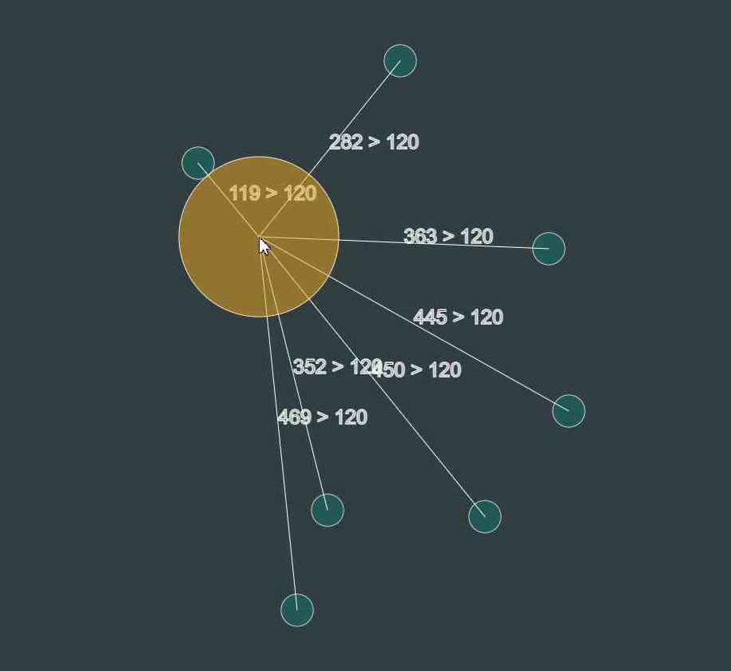
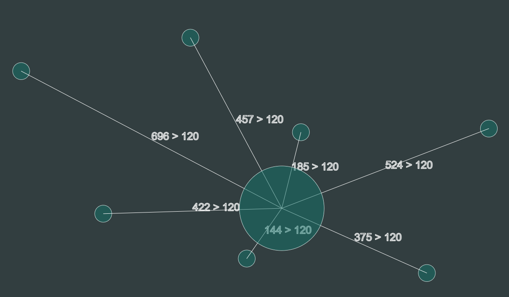

# `Circles`
Aplikacja generująca **n** obiektów Circle oraz główny obiekt Circle sterowany myszką.
Gdy dojdzie do kolizji główny zmienia kolor 

## `tech:`
- canvas
- javascript

## `Screens:`

`kolizja`

`brak kolizji`

